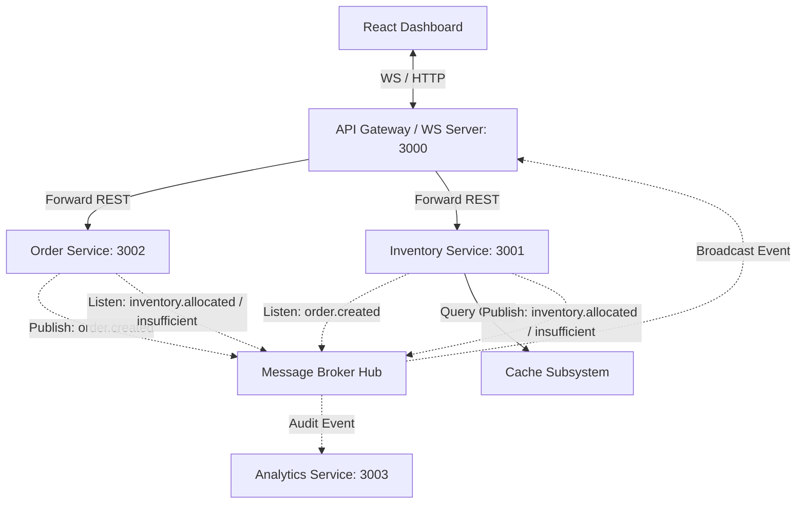

# Distributed Inventory Management System (DIMS)

A high-fidelity **Distributed Inventory Management System** designed to demonstrate real-world backend engineering and system design patterns. The codebase features a choreographed event-driven microservices architecture, localized database separation, read-through caching, and a premium real-time React visualization dashboard.

---

## 🏗️ Architecture & System Topology

The system separates concerns across four decoupled services communicating asynchronously. A single API Gateway acts as the HTTP router and streams all microservice event transactions to the frontend via WebSockets.



### Key Technologies
* **Runtime**: Node.js, TypeScript
* **Database Layer**: SQLite + Prisma ORM (Isolated client runtimes per microservice)
* **Caching**: Redis (Write-Invalidate / 10s TTL read-through caching)
* **Message Broker**: RabbitMQ (Topic Exchange & Queue Bindings)
* **Frontend Dashboard**: Vite, React, Vanilla CSS

---

## ⚡ Zero-Dependency Hybrid Infrastructure Adapter

To make this project **instantly runnable out-of-the-box** without forcing local installations of Redis or RabbitMQ:
* The adapters in `shared/broker.ts` attempt to connect to standard Redis (`6379`) and RabbitMQ (`5672`) instances first.
* If the servers are offline, the system **automatically falls back to a custom, process-isolated HTTP Broker and Cache Server** hosted by the API Gateway.
* Microservices subscribe/publish to the broker using native `fetch` webhooks under the hood. **The backend code and client logic remain 100% identical** regardless of the mode!

---

## 📂 Project Structure

```
├── dashboard/                 # React + Vite frontend dashboard
│   ├── src/
│   │   ├── App.tsx            # Topology graph, sandbox, logs UI
│   │   └── index.css          # Glassmorphic layout styling
│   └── index.html
├── services/                  # Microservices
│   ├── gateway/               # REST Reverse Proxy & WebSocket Broadcaster
│   ├── order/                 # Order creation, transitions & DB (Port 3002)
│   ├── inventory/             # Stock allocations, caching & DB (Port 3001)
│   └── analytics/             # Audit logging & metrics database (Port 3003)
├── shared/                    # Common contracts & broker abstractions
│   ├── types.ts               # Shared TypeScript schemas & Event types
│   └── broker.ts              # Real/Simulated MQ and Redis Client factory
├── package.json               # Monorepo setup scripts
└── tsconfig.json
```

---

## 🚀 Getting Started

Ensure you have **Node.js (v18+)** installed.

### 1. Setup Dependencies and Databases
Run the setup command from the project root to install monorepo packages, compile the shared module, and generate the localized SQLite databases:
```bash
npm run setup
```

### 2. Start the Development Environment
Boot the API Gateway, the three microservices, and the React dashboard concurrently:
```bash
npm run dev
```

### 3. Open the Dashboard UI
Open your browser and navigate to:
👉 **[http://localhost:5173](http://localhost:5173)**

---

## 🕹️ System Design Playgrounds to Try

### 1. Successful Fulfillment Flow
1. Select a product in the **Order Sandbox** panel (e.g. *Developer Laptop X1*).
2. Set quantity to `2` and click **Place Order**.
3. Watch the SVG canvas flash:
   * **API Gateway** proxies request -> **Order Service** creates a `PENDING` database record -> publishes `order.created`.
   * **Inventory Service** consumes event -> performs an ACID transaction check -> decrements SQLite stock -> invalidates cache -> publishes `inventory.allocated`.
   * **Order Service** consumes allocation -> updates database state to `COMPLETED` -> publishes `order.completed`.
   * **Analytics Service** logs all events to the central audit tail.

### 2. Stock Insufficient Rollback Flow
1. Try placing an order for `100` Laptops (exceeding availability).
2. Watch the SVG flow lines highlight a transaction failure:
   * **Inventory Service** transactions fail validation -> publishes `inventory.insufficient`.
   * **Order Service** receives failure -> transitions the database record to `CANCELLED` -> publishes `order.cancelled`.

### 3. Read-Through Caching Performance
1. Manually adjust stock levels in the *Inventory Warehouses* tab (invalidates cache).
2. Click **Refresh Stock Levels** -> inspect console/dashboard console logs. The first refresh is a database query (`CACHE_MISS`).
3. Refresh again within 10 seconds -> loaded instantly from memory (`CACHE_HIT`).

---

## 🔌 Connecting Real Infrastructure (Redis & RabbitMQ)

If you wish to run actual Redis and RabbitMQ servers:
1. Start them locally:
   ```bash
   brew install redis rabbitmq
   brew services start redis
   brew services start rabbitmq
   ```
2. Restart the monorepo dev server: `npm run dev`.
3. The system will auto-detect the live ports and output logs showing successful connections to Redis and RabbitMQ instead of the HTTP simulator fallbacks!
